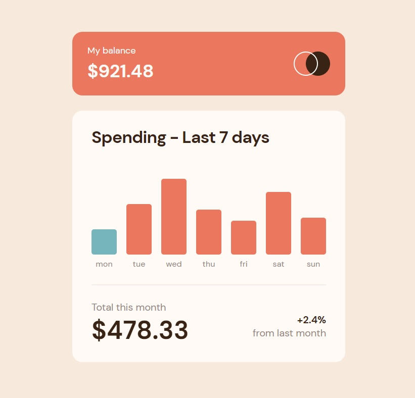

# Frontend Mentor - Expenses chart component solution

This is a solution to the [Expenses chart component challenge on Frontend Mentor](https://www.frontendmentor.io/challenges/expenses-chart-component-e7yJBUdjwt). Frontend Mentor challenges help you improve your coding skills by building realistic projects.

## Table of contents

- [Overview](#overview)
  - [The challenge](#the-challenge)
  - [Screenshot](#screenshot)
  - [Links](#links)
- [My process](#my-process)
  - [Built with](#built-with)
  - [What I learned](#what-i-learned)
  - [Continued development](#continued-development)
- [Author](#author)

## Overview

### The challenge

Users should be able to:

- View the bar chart and hover over the individual bars to see the correct amounts for each day
- See the current day’s bar highlighted in a different colour to the other bars
- View the optimal layout for the content depending on their device’s screen size
- See hover states for all interactive elements on the page
- **Bonus**: Use the JSON data file provided to dynamically size the bars on the chart

### Screenshot

### Links

- Solution URL: [https://github.com/wavegate/expenses-chart-component-main](https://github.com/wavegate/expenses-chart-component-main)
- Live Site URL: [https://curious-basbousa-b6689b.netlify.app/](https://curious-basbousa-b6689b.netlify.app/)

## My process

### Built with

- Semantic HTML5 markup
- CSS custom properties
- Flexbox
- JavaScript

### What I learned

- You can modify the content of a pseudo-element with JavaScript with the `attr()` function in CSS and setting the variable in JavaScript. e.g. `mon.setAttribute("data-before", "$" + data[0].amount);`

### Continued development

- Building a bar graph out of scratch was a little annoying with all the divs that I used. I'm curious what kind of libraries can be used to generate bar graphs.

## Author

- Website - [wavegate](https://github.com/wavegate)
- Frontend Mentor - [@wavegate](https://www.frontendmentor.io/profile/wavegate)
